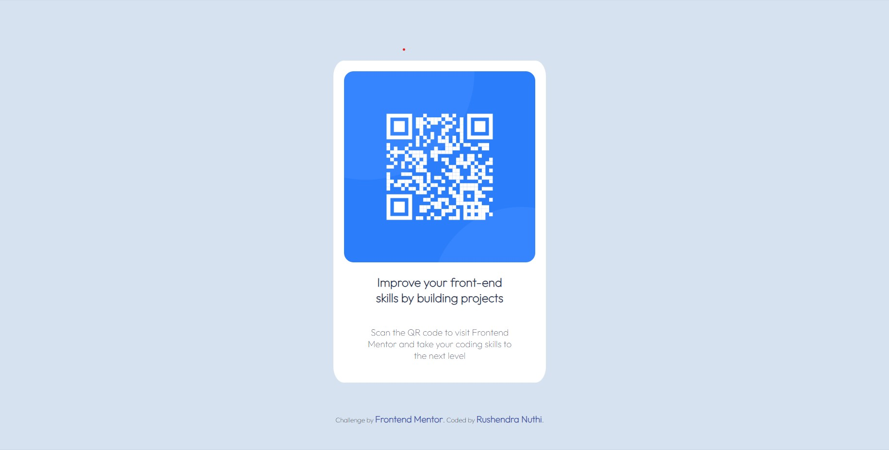

# Frontend Mentor - QR code component solution

This is a solution to the [QR code component challenge on Frontend Mentor](https://www.frontendmentor.io/challenges/qr-code-component-iux_sIO_H). Frontend Mentor challenges help you improve your coding skills by building realistic projects. 

## Table of contents

- [Overview](#overview)
  - [Screenshot](#screenshot)
  - [Links](#links)
- [Author](#author)

## Overview

### Screenshot

### Links

- Solution URL: [Github Repo](https://github.com/RushendraNuthi/QRCodechallenge)
- Live Site URL: [QR Code Challenge](https://rushendranuthi.github.io/QRCodechallenge)
## Author

- Github - [Rushendra Nuthi](https://www.github.com/RushendraNuthi)
- Frontend Mentor - [@RushendraNuthi](https://www.frontendmentor.io/profile/RushendraNuthi)